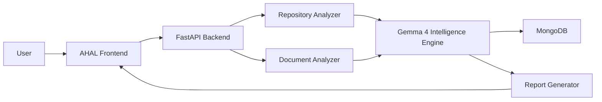
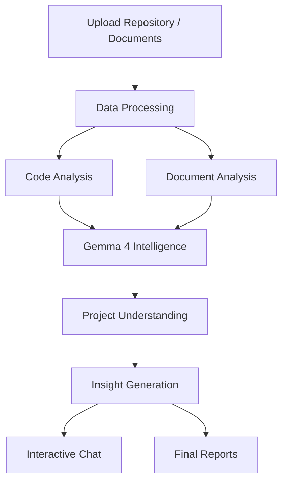

# <div align="center">


# 🚀 AHAL AI V2

### *Intelligence That Brings Light*


<br>


### 🎯 One-Line Pitch

**AHAL AI V2 transforms repositories, documents, and technical assets into intelligent project understanding, actionable insights, and developer-ready knowledge powered by Gemma 4.**

</div>

---

# 📖 Overview

## Problem Statement

Modern software projects are becoming increasingly complex.

Developers, founders, recruiters, investors, and hackathon judges often struggle to quickly understand:

* What a project actually does
* Why it exists
* How the architecture works
* What technologies are used
* How components interact
* Whether the project is scalable and production-ready

Understanding a codebase can take hours—or even days.

---

## 💡 Solution

**AHAL AI V2** is an AI-powered software intelligence platform that automatically analyzes repositories, documents, source code, and project assets to generate meaningful insights.

Instead of manually reading thousands of lines of code, users receive:

* Executive summaries
* Problem statements
* Architecture understanding
* Technical analysis
* Documentation insights
* Project intelligence reports
* AI-assisted conversations about the project

AHAL AI acts as an intelligent technical analyst for any software project.

---

# 🌟 Why AHAL AI Matters

AHAL AI bridges the gap between:

| Traditional Approach            | AHAL AI                     |
| ------------------------------- | --------------------------- |
| Read thousands of lines of code | Instant understanding       |
| Manual architecture analysis    | Automated insights          |
| Complex onboarding              | Fast project discovery      |
| Static documentation            | Interactive AI intelligence |
| Time-consuming reviews          | Instant evaluation          |

---

# ✨ Core Features

| Feature                         | Description                                                      |
| ------------------------------- | ---------------------------------------------------------------- |
| 🤖 AI Repository Analysis       | Deep understanding of GitHub repositories and source code        |
| 📄 Document Intelligence        | Extract insights from PDFs, reports, and technical documentation |
| 💬 Conversational AI            | Ask questions about projects naturally                           |
| 🏗 Architecture Understanding   | Generates system-level understanding automatically               |
| 🎯 Problem & Solution Detection | Identifies project goals and business value                      |
| 📊 Executive Reports            | Creates polished project summaries                               |
| 🔍 Multi-Source Analysis        | Combines code, documents, and metadata                           |
| ⚡ Gemma 4 Intelligence Layer    | High-quality reasoning and contextual understanding              |

---

# 🛠️ Technology Stack

## Frontend


## Backend


## Database


## AI Layer


## Deployment


---

# 📊 Tech Stack Summary

| Layer            | Technology                            |
| ---------------- | ------------------------------------- |
| Frontend         | React, TypeScript, Tailwind CSS       |
| Backend          | FastAPI, Python                       |
| Database         | MongoDB                               |
| AI Engine        | Gemma 4                               |
| Authentication   | JWT                                   |
| Deployment       | Vercel, Render                        |
| Additional Tools | GitHub API, PDF Processing, Analytics |

---

# 🏗️ System Architecture



---

# 🔄 Workflow



---

# 🚀 Installation Guide

## Clone Repository

```bash
git clone https://github.com/bsrikumar855-dot/AHAL-V2.git

cd AHAL-V2
```

---

# ⚙️ Backend Setup

## Create Virtual Environment

```bash
python -m venv venv
```

Activate Environment

```bash
source venv/bin/activate
```

Install Dependencies

```bash
pip install -r requirements.txt
```

Run Backend

```bash
uvicorn app.main:app --reload
```

---

# 🎨 Frontend Setup

```bash
cd frontend

npm install

npm run dev
```

---

# 🔐 Environment Variables

Create `.env`

```env
MONGODB_URL=
JWT_SECRET=
GEMMA_API_KEY=
GITHUB_TOKEN=
APP_ENV=development
```

---

# 🔌 Core API Endpoints

| Method | Endpoint     | Description      |
| ------ | ------------ | ---------------- |
| POST   | /api/analyze | Analyze Project  |
| POST   | /api/chat    | AI Chat          |
| POST   | /api/upload  | Upload Documents |
| GET    | /api/report  | Generate Reports |
| GET    | /api/project | Project Metadata |
| GET    | /health      | Health Check     |

---

# 📂 Project Structure

```bash
AHAL-V2
│
├── frontend
│   ├── src
│   ├── components
│   ├── pages
│   └── assets
│
├── app
│   ├── api
│   ├── chat
│   ├── docs
│   ├── intelligence
│   ├── llm
│   ├── services
│   └── database
│
├── reports
├── docs
├── screenshots
├── requirements.txt
└── README.md
```

---

# 🎯 Demo Flow For Judges

### Step 1

Upload a GitHub repository or project assets.

### Step 2

AHAL automatically analyzes:

* Source Code
* Project Structure
* Documentation
* Architecture

### Step 3

Gemma 4 generates:

* Project Summary
* Problem Statement
* Solution Analysis
* Technical Overview

### Step 4

Interact with the AI assistant.

Ask:

* What does this project do?
* Why was it built?
* Explain the architecture.
* What technologies are used?

### Step 5

Generate polished reports and project intelligence.

---

# 👥 Team

| Member         | Role                |
| -------------- | ------------------- |
| Shree Kumar    | AI & Product Lead   |
| Santheesh Saha | AI Engineer         |
| Sharun K       | Backend Engineer    |
| Vishal         | Frontend Engineer   |
| Tharun B.L     | Full Stack Engineer |

---

# 🏆 Hackathon Highlights

✅ Powered by Gemma 4

✅ Solves a real developer pain point

✅ AI-first architecture

✅ Fast and scalable backend

✅ Production-oriented design

✅ Startup-ready vision

✅ Real-world impact

---

# 🛣️ Roadmap

### Current

* [x] Repository Analysis
* [x] AI Chat
* [x] Document Intelligence
* [x] Project Reports

### Upcoming

* [ ] VS Code Extension
* [ ] Multi-Agent System
* [ ] Architecture Visualization
* [ ] GitHub Pull Request Intelligence
* [ ] Team Collaboration Features

### Future Vision

* [ ] Enterprise Workspace
* [ ] AI Project Auditor
* [ ] Startup Due Diligence Assistant
* [ ] Autonomous Technical Consultant

---

# 🌍 Vision

We believe understanding software should be as easy as talking to an expert.

AHAL AI V2 is building the future of software intelligence by enabling anyone—developers, founders, recruiters, investors, and judges—to instantly understand any project with AI-powered clarity.

---

# 📜 License

```text
MIT License

Copyright (c) 2026 AHAL AI

Permission is hereby granted, free of charge,
to any person obtaining a copy of this software...
```

---

# ⭐ Support

If you find AHAL AI valuable:

⭐ Star the repository

🍴 Fork the project

🤝 Contribute

📢 Share with your network

💡 Help us improve software intelligence

---

<div align="center">

# 🚀 Built with dedication by Team AHAL

### AHAL AI V2 — Intelligence That Brings Light

*Turning Complex Software Into Clear Understanding.*

</div>


